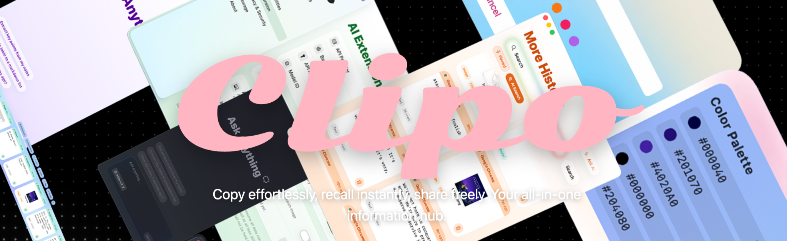
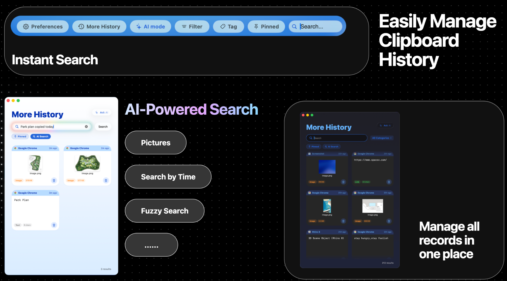
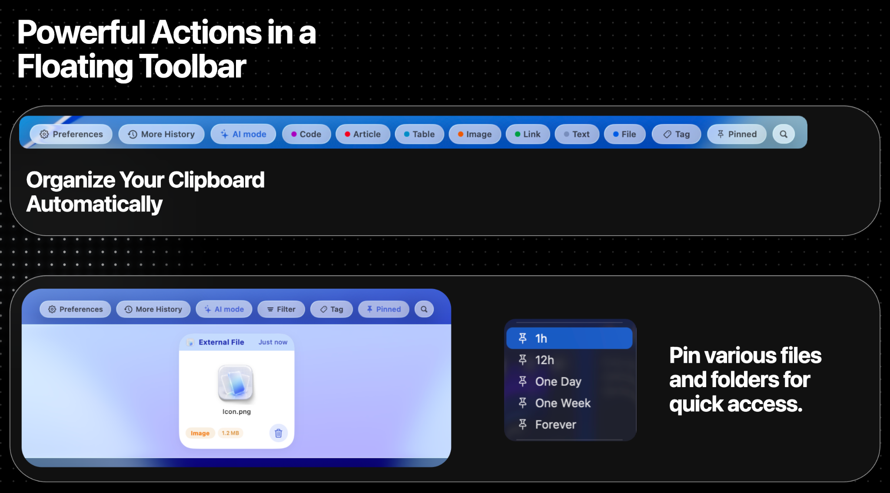
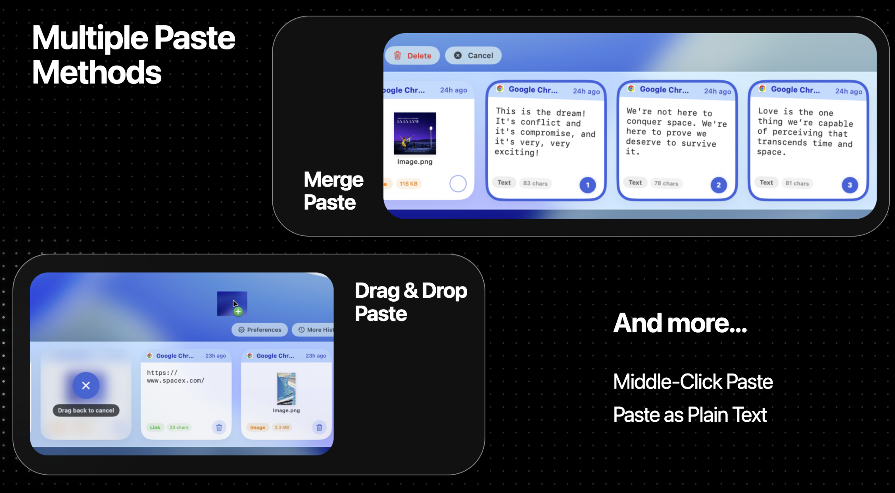
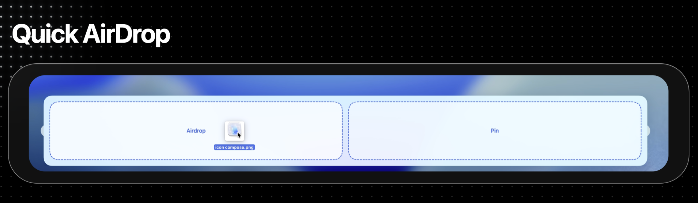
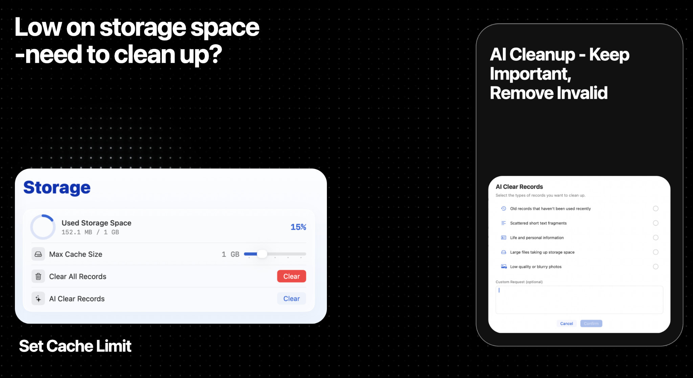
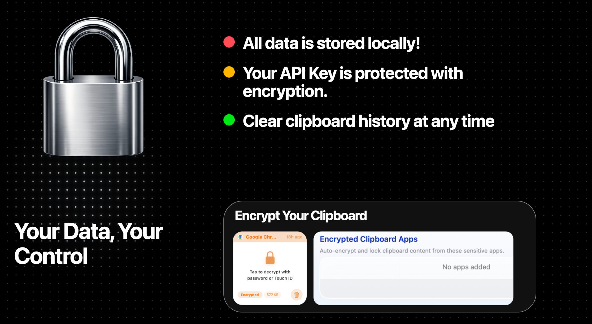
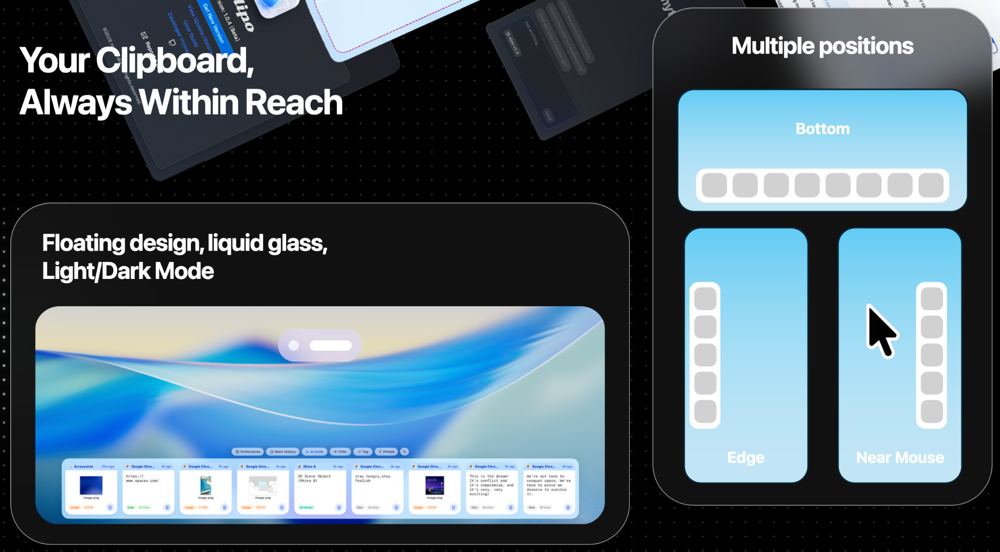

# Quick Guides

**中文快速指南:** [观看视频](https://www.youtube.com/watch?v=F_4WICR8o4o)

**英文快速指南:** [English Quick Guide](https://www.youtube.com/watch?v=Z2NndflBPVw)

# Homebrew Installation

You can install Clipo via Homebrew with the following commands:

```bash
brew tap guluguludog-alt/clipo
brew trust guluguludog-alt/clipo
brew install --cask clipo
```


# Clipo — Software Introduction & User Manual  
# Clipo — 软件介绍与用户手册

> A floating, AI-ready clipboard hub for macOS.  
> 一个面向 macOS 的悬浮式、可接入 AI 的剪贴板与文件中转中心。



---

## English Version

### 1. What is Clipo?

Clipo is a modern macOS clipboard manager built around a floating liquid-glass panel. It keeps copied text, links, images, files, rich text, tables, code snippets, and other clipboard records in one place, then lets you recall, search, paste, pin, organize, transfer, AirDrop, or process them with AI.

Unlike a traditional clipboard history list, Clipo is designed as a quick-access information hub. It can stay at the bottom of the screen, appear from an edge panel, or open near your mouse. It also supports multiple paste workflows, drag-and-drop file transfer, quick AirDrop, AI search, AI cleanup, and local storage management.

### 2. Core Features at a Glance

| Area | What Clipo Does |
|---|---|
| Clipboard Management | Automatically captures clipboard history and displays it as visual cards. |
| File Transfer Station | Temporarily stores copied or dragged files for quick access, pinning, dragging, and pasting. |
| Quick AirDrop | Send files, images, or selected clipboard records through AirDrop with fewer steps. |
| AI Extension | Search, summarize, edit, translate, clean, and process clipboard content using your own AI model endpoint. |
| Storage Management | Set cache limits, clear old records, and use AI to identify invalid or unnecessary records. |
| Privacy & Security | Clipboard data is stored locally; API keys are saved through encrypted storage; sensitive records can be encrypted. |
| Flexible Access | Open the panel by shortcut, screen edge, middle mouse button, or near-mouse mode. |
| Multiple Paste Methods | Paste normally, paste as plain text, merge paste, drag-and-drop paste, and middle-click paste. |

---

## 3. Clipboard Management



Clipo automatically monitors the macOS pasteboard and saves clipboard records as cards. Each card keeps useful context, including source app, copied time, content preview, type label, file size or character count, thumbnail, and app icon when available.

Supported record types include:

- Text, links, articles, code, tables, images, files, audio, video, 3D/model data, and general clipboard content.
- Rich text representations, plain text fallback, image thumbnails, original image data, and external file URLs.
- Source app information, timestamp, paste count, last pasted time, tags, and pinned status.

### 3.1 Visual Card Layout

Each clipboard item is shown as a card rather than a plain line of text. This makes it easier to distinguish screenshots, links, code, files, and text snippets at a glance.

A typical card can show:

- The source app, such as Chrome, WPS, Finder, or another app.
- Relative copy time, such as “Just now”, “2m ago”, or “24h ago”.
- A preview thumbnail for images and files.
- A category pill, such as Image, Link, Text, File, Code, Article, or Table.
- Size information, such as image size, file size, or text character count.
- Hover actions, delete button, pin menu, tag menu, encryption, AirDrop, and AI actions.

### 3.2 More History Window

The More History window gives you a full-screen style management view for all clipboard records. It is useful when you want to search deeply, browse large history collections, or manage many records at once.

You can use it to:

- Search clipboard records instantly.
- Search by category, app, content, time, or visual meaning.
- Filter by pinned items, tags, and record type.
- Review images and file cards in a larger grid.
- Delete unwanted records.
- Run AI-powered search for fuzzy or semantic queries.

### 3.3 Tags, Categories, and Similar Records



Clipo includes a floating toolbar for quick organization. You can filter by categories such as Code, Article, Table, Image, Link, Text, and File. You can also create tags and attach records to custom groups.

Useful organization tools include:

- **Auto categories**: Clipo classifies records into common clipboard types.
- **Tags**: Add custom tags for projects, clients, design references, or temporary tasks.
- **Pinned records**: Keep important items accessible for a set duration or forever.
- **Find Similar Records**: Locate clipboard items that are similar to a selected card.
- **Multi-select**: Select several cards for batch operations, deletion, merge paste, AI processing, or AirDrop.

---

## 4. File Transfer Station

Clipo is not only a clipboard history app. It also works as a temporary file transfer station.

You can copy or drag files into Clipo, then quickly reuse them later without searching Finder again. This is especially useful for screenshots, icons, PDFs, design assets, documents, downloaded files, and files that need to be sent to multiple apps.

### 4.1 Pin Files and Folders for Quick Access


Files can be pinned for temporary or permanent access. Available pin durations include short-term options such as 1 hour, 3 hours, 12 hours, one day, one week, and forever.

Use pinned files when you need to:

- Keep a file ready while switching between apps.
- Reuse the same attachment in multiple conversations.
- Keep project assets available during a working session.
- Prevent important records from being removed during cleanup.

### 4.2 Drag & Drop Paste



You can drag a file, image, or card from Clipo into another app. This is useful for apps that accept drag-and-drop upload or attachment workflows, such as chat tools, browsers, document editors, and AI upload boxes.

Typical workflow:

1. Open the Clipo panel.
2. Locate the file, image, or clipboard card.
3. Drag it into the target app.
4. Drop it into an upload area, document, chat box, or file field.

The app also supports drag-back cancellation, so you can cancel an accidental drag without changing your workflow.

### 4.3 Open in Finder and Open File

For file-based records, Clipo can open the file directly or reveal it in Finder. This makes it useful as a lightweight file launcher for recently copied or pinned items.

---

## 5. Quick AirDrop



Clipo includes a quick AirDrop workflow for both clipboard records and external files.

You can AirDrop:

- A single clipboard item.
- Multiple selected records.
- Files dragged into the Clipo AirDrop area.
- Images or file records stored in history.
- Text content when a record can be shared as text.

### 5.1 How to Use Quick AirDrop

1. Open the Clipo panel.
2. Select or drag the item you want to send.
3. Drop it into the AirDrop target area, or choose AirDrop from the card action menu.
4. Select the nearby device in the macOS AirDrop sharing sheet.

This reduces the need to open Finder, locate a file, right-click, choose Share, then choose AirDrop manually.

### 5.2 AirDrop + Pin Drop Zone

Clipo’s external file utility area can expose two drop targets:

- **AirDrop**: Send the dragged file immediately through AirDrop.
- **Pin**: Store the dragged file in Clipo and pin it for quick reuse.

This turns the panel into a small transfer dock for daily file movement.

---

## 6. AI-Powered Clipboard Features


Clipo can connect to an OpenAI-compatible API endpoint. You can configure your own Base URL, API Key, and Model ID, then use AI to search, summarize, rewrite, translate, clean, or process clipboard records.

### 6.1 AI Search

AI search is useful when keyword search is not enough. You can ask natural-language questions such as:

- “Find the movie poster I copied yesterday.”
- “Show me the park plan image.”
- “Find links I copied today.”
- “Find the text about the architecture project.”
- “Search for the screenshot with a blue background.”

AI can search based on content relevance, semantic meaning, source app, copied time, and image descriptions when image indexing is enabled.

### 6.2 Ask AI About Clipboard Items

You can send one or multiple clipboard cards to the AI window and ask Clipo to process them.

Examples:

- Summarize a copied article.
- Rewrite a copied email professionally.
- Translate selected text.
- Format JSON or code snippets.
- Extract key points from notes.
- Compare several copied records.
- Generate a reply based on copied context.

### 6.3 Send Multiple Clipboard Items to AI

Clipo supports sending multiple selected items into the AI input area. This is useful when you want the model to combine information from several records, such as multiple quotes, screenshots, links, text fragments, or files.

### 6.4 AI Edit, Delete, and Clipboard Actions

Clipo can optionally allow AI to modify or delete clipboard records. This is controlled by a setting, so AI cannot change your history unless you enable that permission.

When enabled, AI can help with tasks such as:

- Delete specific records you ask it to remove.
- Modify text-based clipboard content.
- Show matching records as cards in the AI conversation.
- Clean up useless or duplicate content after your review.

### 6.5 AI Image Indexing

If your model supports vision, Clipo can generate image descriptions for image records. This makes visual clipboard history searchable by meaning instead of only by file name.

For example, you can search for:

- “the screenshot with a green map”
- “the blurry photo”
- “the blue icon image”
- “the La La Land poster”

---

## 7. Storage Space Management



Clipo includes a storage page for controlling how much disk space clipboard history can use.

### 7.1 Cache Limit

You can set a maximum cache size. Available tiers include common limits such as 500 MB, 1 GB, 2 GB, 5 GB, and 10 GB.

When storage usage exceeds the selected limit, Clipo can remove older records until usage falls below the limit. Pinned records can be protected depending on the cleanup option you choose.

### 7.2 Clear All Records

You can clear all clipboard records and temporary drag files. Clipo can also keep pinned records if you choose to preserve them.

### 7.3 AI Cleanup

AI Cleanup helps identify records that may no longer be useful.

Available cleanup criteria include:

- Old records that have not been used recently.
- Scattered short text fragments.
- Life and personal information.
- Large files taking up storage space.
- Low-quality or blurry photos.
- Duplicate or very similar records.
- Custom cleanup requests.

Clipo filters results first, then lets you review the selected records before deletion.

---

## 8. Privacy, Local Data, and Encryption



Clipo is designed around local-first clipboard storage.

### 8.1 Local Storage

Clipboard history is stored locally on your Mac. The app keeps its history and cache under the app’s local application support area.

### 8.2 API Key Protection

Your AI API key is stored through encrypted keychain-based storage rather than plain UserDefaults. The AI settings page uses a secure input field for the key.

### 8.3 Encrypted Clipboard Records

Clipo supports encrypted records. You can encrypt a card manually, or configure sensitive apps so clipboard records from those apps are automatically locked.

Encrypted records can require macOS authentication, such as password or Touch ID, before they are unlocked.

### 8.4 Exclusions

You can exclude specific apps from clipboard history capture. You can also exclude apps from middle-click panel activation to avoid conflicts in apps where middle click has another purpose.

---

## 9. Multiple Paste Methods


Clipo supports different paste workflows so you can choose the fastest method for each situation.

### 9.1 Normal Paste

Select a card and paste it into the frontmost app. Depending on your settings, the primary card action can be copy or paste.

### 9.2 Double-Click or Enter Paste

You can configure what happens when you double-click a card or press Enter on a selected card. Common choices include paste, copy, or other card actions.

### 9.3 Paste as Plain Text

Use Paste as Plain Text to remove formatting and paste only clean text. This is useful when copying from websites, PDFs, emails, or documents with unwanted styling.

### 9.4 Merge Paste

In multi-select mode, select several records and paste them together. This is useful for combining text snippets, links, notes, or multiple copied fragments into one output.

### 9.5 Drag & Drop Paste

Drag images, files, and cards into compatible apps or upload areas.

### 9.6 Middle-Click Paste

The middle mouse button workflow lets you summon the panel, hover/select a card, and paste quickly without moving through a full window workflow.

---

## 10. Multiple Panel Opening Methods and Positions



Clipo’s floating panel is designed to appear where it is most useful.

### 10.1 Panel Positions

Supported panel positions include:

- **Bottom**: A horizontal panel at the bottom of the screen.
- **Left edge**: A vertical panel along the left side.
- **Right edge**: A vertical panel along the right side.
- **Near mouse**: A quick-access layout near the pointer, especially useful with middle-click workflows.

### 10.2 Opening Methods

You can enable one or more ways to open Clipo:

- **Shortcut key**: Open the panel from anywhere.
- **Screen edge**: Move to a screen edge to reveal the side panel.
- **Middle mouse button**: Press or hold the middle mouse button to open a near-mouse panel.
- **Menu bar access**: Open settings, history, AI, and panel controls from the macOS menu bar icon.

### 10.3 Release-to-Close

Clipo can automatically close the panel when you release the shortcut key. This makes it feel like a quick command palette for clipboard actions.

When text input is active in the panel, the panel should stay open so you can finish typing. You can close it by pressing Esc, clicking outside, or pressing the shortcut again.

### 10.4 Remember Panel Mode

Clipo can remember the panel state and position after closing, so the next opening feels consistent with your last workflow.

---

## 11. Recommended Workflows

### 11.1 Quick Paste a Recent Item

1. Copy anything from any app.
2. Open Clipo with your shortcut.
3. Select the card.
4. Paste normally or as plain text.

### 11.2 Reuse Files Across Apps

1. Copy or drag a file into Clipo.
2. Pin it for 1 hour, 12 hours, one week, or forever.
3. Drag it into chat, browser, document editor, or upload field when needed.

### 11.3 AirDrop a Recently Copied File

1. Open the panel.
2. Select the file record.
3. Choose AirDrop or drop it into the AirDrop target.
4. Pick the receiving device.

### 11.4 Search Old Clipboard Records with AI

1. Open More History or AI mode.
2. Type a natural-language query.
3. Review the cards returned by AI.
4. Paste, pin, tag, delete, or send them to AI for further processing.

### 11.5 Clean Storage Safely

1. Open Storage settings.
2. Review used space and cache limit.
3. Use AI Cleanup or Clear All Records.
4. Review AI-filtered records before deleting.
5. Keep pinned records if they are important.

---

## 12. Settings Guide

| Setting | Purpose |
|---|---|
| Panel Position | Choose bottom, left, or right panel layout. |
| Panel Opening Method | Enable shortcut, screen edge, or middle mouse opening. |
| Release Key to Close | Automatically close the panel after releasing the shortcut. |
| Remember Panel Mode | Preserve the previous panel mode after closing. |
| Primary Card Action | Decide what happens when a card is committed. |
| Double-Click Card Action | Configure double-click behavior. |
| Storage Limit | Control maximum cache usage. |
| AI Provider | Use an OpenAI-compatible endpoint. |
| Base URL | Set your AI provider API base URL. |
| API Key | Store your key securely. |
| Model ID | Choose the model used for AI chat and search. |
| AI Readable Text/Image Records | Limit how much clipboard context AI can access. |
| Auto-Index Images | Generate image descriptions for visual search. |
| Allow AI Delete/Modify | Give AI permission to modify or delete records. |
| Encrypted Apps | Auto-lock clipboard content from sensitive apps. |
| Excluded Apps | Prevent selected apps from being recorded or avoid middle-click conflicts. |

---

## 13. Tips

- Pin important files before clearing storage.
- Use tags for projects or clients.
- Use AI Search when you remember meaning but not exact keywords.
- Use Paste as Plain Text when copying from rich websites or PDFs.
- Use the AirDrop drop zone for fast device-to-device transfer.
- Keep AI readable limits reasonable if your history is very large.
- Use encrypted records for sensitive copied content.

---

# 中文版本

## 1. Clipo 是什么？

Clipo 是一款面向 macOS 的现代化剪贴板管理工具。它以悬浮式液态玻璃面板为核心，把你复制过的文字、链接、图片、文件、富文本、表格、代码片段等内容统一保存为可视化卡片，并支持快速搜索、调用、粘贴、固定、分类、文件中转、快捷 AirDrop 以及 AI 处理。

它不是一个简单的剪贴板历史列表，而是一个“随手可调出的信息中转站”。你可以把它放在屏幕底部、屏幕左右边缘，或者通过中键在鼠标附近快速打开。它还支持多种粘贴方式、拖拽上传、AI 语义搜索、AI 清理和本地存储空间管理。

---

## 2. 核心功能总览

| 功能模块 | 说明 |
|---|---|
| 剪贴板管理 | 自动记录剪贴板历史，并以卡片形式展示。 |
| 文件中转站 | 临时保存复制或拖入的文件，支持固定、拖拽、粘贴和快速调用。 |
| 快捷 AirDrop | 将文件、图片或选中的剪贴板记录快速通过 AirDrop 发送。 |
| AI 扩展 | 接入自定义 AI 模型，用于搜索、总结、改写、翻译、清理和处理剪贴板内容。 |
| 存储空间管理 | 设置缓存上限，清理历史记录，并用 AI 识别无效或冗余内容。 |
| 隐私与加密 | 数据本地保存，API Key 使用加密存储，敏感记录可单独加密。 |
| 多种打开方式 | 支持快捷键、屏幕边缘、中键、鼠标附近和菜单栏入口。 |
| 多种粘贴方式 | 支持普通粘贴、纯文本粘贴、合并粘贴、拖拽粘贴和中键粘贴。 |

---

## 3. 剪贴板管理


Clipo 会自动监听 macOS 剪贴板，并把新的复制内容保存为历史卡片。每张卡片会保留关键上下文，例如来源应用、复制时间、内容预览、类型标签、文件大小或字符数、缩略图和应用图标等。

支持记录的内容类型包括：

- 文本、链接、文章、代码、表格、图片、文件、音频、视频、3D/模型数据以及普通剪贴板内容。
- 富文本、纯文本备份、图片缩略图、原图数据和外部文件路径。
- 来源应用、复制时间、粘贴次数、上次粘贴时间、标签、固定状态等信息。

### 3.1 可视化卡片

Clipo 用卡片展示剪贴板，而不是一行行纯文本。这样你可以一眼区分截图、链接、代码、文件和文本片段。

一张卡片通常会显示：

- 来源应用，例如 Chrome、WPS、Finder 等。
- 相对时间，例如 Just now、2m ago、24h ago。
- 图片或文件缩略图。
- 类型标签，例如 Image、Link、Text、File、Code、Article、Table。
- 大小信息，例如图片大小、文件大小或文本字符数。
- 悬浮操作、删除、固定、标签、加密、AirDrop、AI 等快捷入口。

### 3.2 更多历史窗口

“More History” 窗口适合集中管理全部剪贴板记录。当历史很多、需要检索旧内容或批量整理时，可以进入这个大窗口。

你可以在这里：

- 即时搜索剪贴板记录。
- 按类别、应用、内容、时间或语义进行查找。
- 过滤固定项、标签和记录类型。
- 以更大的网格浏览图片和文件卡片。
- 删除无用记录。
- 使用 AI 进行模糊搜索和语义搜索。

### 3.3 标签、分类与相似记录


Clipo 顶部工具栏可以快速整理历史记录。你可以按 Code、Article、Table、Image、Link、Text、File 等类型过滤，也可以创建自定义标签。

常用整理能力包括：

- **自动分类**：Clipo 会把记录归入常见剪贴板类型。
- **标签**：为项目、客户、设计素材或临时任务添加自定义标签。
- **固定记录**：把重要内容固定一段时间或永久固定。
- **查找相似记录**：根据当前卡片查找相似内容。
- **多选模式**：一次选择多个卡片，用于批量删除、合并粘贴、AI 处理或 AirDrop。

---

## 4. 文件中转站

Clipo 不只是剪贴板历史工具，它也可以作为临时文件中转站。

你可以把复制过的文件或拖入的文件保存在 Clipo 中，之后不用再打开 Finder 查找，就能快速再次使用。它尤其适合截图、图标、PDF、设计素材、文档、下载文件，以及需要反复发送到不同应用的附件。

### 4.1 固定文件和文件夹


文件可以被临时或永久固定。可选固定时长包括 1 小时、3 小时、12 小时、一天、一周和永久。

适合固定的场景：

- 多个应用之间反复使用同一个文件。
- 在聊天或邮件中多次发送同一附件。
- 工作过程中临时保存项目素材。
- 清理历史记录时保护重要文件不被删除。

### 4.2 拖拽粘贴


你可以从 Clipo 中把文件、图片或卡片直接拖到其他应用中。对于支持拖拽上传或附件插入的应用，例如聊天工具、浏览器、文档编辑器和 AI 上传框，这会非常方便。

典型流程：

1. 打开 Clipo 面板。
2. 找到文件、图片或剪贴板卡片。
3. 将其拖到目标应用。
4. 放到上传区域、文档、聊天框或文件输入区域。

Clipo 还支持拖回取消，避免误拖后产生不必要的操作。

### 4.3 在 Finder 中显示与打开文件

对于文件类型记录，Clipo 可以直接打开文件，也可以在 Finder 中定位文件。这让它可以作为一个轻量的近期文件启动器。

---

## 5. 快捷 AirDrop


Clipo 内置快捷 AirDrop 工作流，既支持剪贴板记录，也支持外部拖入的文件。

你可以 AirDrop：

- 单个剪贴板项目。
- 多选后的多个记录。
- 拖入 Clipo AirDrop 区域的文件。
- 历史中的图片或文件卡片。
- 可分享为文本的剪贴板内容。

### 5.1 如何使用快捷 AirDrop

1. 打开 Clipo 面板。
2. 选择或拖入你想发送的内容。
3. 将文件放到 AirDrop 区域，或从卡片菜单中选择 AirDrop。
4. 在 macOS AirDrop 分享窗口中选择接收设备。

这样可以省去打开 Finder、定位文件、右键分享、再选择 AirDrop 的繁琐步骤。

### 5.2 AirDrop + 固定文件投放区

Clipo 的外部文件工具区可以提供两个投放目标：

- **AirDrop**：立即通过 AirDrop 发送文件。
- **Pin**：把文件保存到 Clipo 并固定，方便之后使用。

这让 Clipo 变成一个小型文件传输 Dock。

---

## 6. AI 剪贴板功能


Clipo 可以接入 OpenAI Compatible 类型的 API。你可以配置自己的 Base URL、API Key 和 Model ID，然后用 AI 搜索、总结、改写、翻译、清理或处理剪贴板内容。

### 6.1 AI 搜索

当普通关键词搜索不够用时，可以使用 AI 搜索。你可以直接输入自然语言，例如：

- “找到我昨天复制的电影海报。”
- “找一下那个公园平面图图片。”
- “显示今天复制过的链接。”
- “找到关于建筑项目的那段文字。”
- “搜索蓝色背景的截图。”

AI 可以结合内容相关性、语义、来源应用、复制时间以及图片索引说明来查找记录。

### 6.2 对剪贴板项目提问

你可以把一个或多个剪贴板卡片发送到 AI 窗口，让 AI 处理它们。

常见用法：

- 总结复制的文章。
- 把复制的邮件改写得更正式。
- 翻译选中的文本。
- 格式化 JSON 或代码片段。
- 提取笔记要点。
- 对比多个剪贴板记录。
- 根据复制内容生成回复。

### 6.3 发送多个剪贴板项目给 AI

Clipo 支持将多个选中的项目一起放入 AI 输入区。适合处理多段文字、多个截图、多个链接或多个文件，并让 AI 综合分析。

### 6.4 AI 编辑、删除与剪贴板操作

Clipo 可以选择性允许 AI 修改或删除剪贴板记录。这个权限需要你手动开启，所以 AI 默认不能随意更改历史。

开启后，AI 可以帮助你：

- 删除你指定的记录。
- 修改文本类剪贴板内容。
- 在对话中以卡片形式显示匹配记录。
- 根据你的要求清理无用或重复内容。

### 6.5 AI 图片索引

如果你配置的模型支持视觉能力，Clipo 可以为图片生成语义说明，让图片也能被自然语言搜索。

例如你可以搜索：

- “绿色地图截图”
- “模糊的照片”
- “蓝色图标图片”
- “La La Land 海报”

---

## 7. 存储空间管理


Clipo 提供存储页面，用于控制剪贴板历史占用的磁盘空间。

### 7.1 缓存上限

你可以设置最大缓存空间。常见档位包括 500 MB、1 GB、2 GB、5 GB 和 10 GB。

当实际使用空间超过上限时，Clipo 可以从较旧记录开始清理，直到低于设定上限。固定记录可以根据你的选择被保留。

### 7.2 清除全部记录

你可以清除所有剪贴板记录和临时拖拽文件，也可以选择保留固定项。

### 7.3 AI 清理

AI 清理可以帮助你找出可能不再有用的记录。

可选清理条件包括：

- 最近未使用的旧记录。
- 零散短文本片段。
- 生活和个人信息。
- 占用空间较大的文件。
- 低质量或模糊照片。
- 重复或非常相似的记录。
- 自定义清理需求。

Clipo 会先筛选结果，再让你确认后删除，不会直接跳过确认。

---

## 8. 隐私、本地数据与加密


Clipo 以本地优先为设计原则。

### 8.1 本地保存

剪贴板历史保存在你的 Mac 本地。应用会在本地 Application Support 目录中维护历史和缓存。

### 8.2 API Key 加密保护

AI API Key 通过加密的 Keychain 存储，而不是明文保存在 UserDefaults 中。设置界面也使用安全输入框显示 Key。

### 8.3 加密剪贴板记录

Clipo 支持对单个剪贴板项目进行加密，也可以把某些敏感应用加入加密列表，让这些应用产生的剪贴板记录自动锁定。

加密记录在解锁前需要通过 macOS 身份验证，例如密码或 Touch ID。

### 8.4 排除应用

你可以把某些应用排除在剪贴板记录之外，也可以单独排除中键面板，避免中键与特定软件快捷操作冲突。

---

## 9. 多种粘贴方式


Clipo 提供多种粘贴方式，让你根据不同场景选择最快的操作。

### 9.1 普通粘贴

选中一张卡片后，将其粘贴到当前前台应用中。你可以在设置中决定卡片的主要操作是复制还是粘贴。

### 9.2 双击或回车粘贴

你可以设置双击卡片或按下 Enter 时执行的行为，例如粘贴、复制或其他卡片操作。

### 9.3 纯文本粘贴

“Paste as Plain Text” 可以去除格式，只粘贴干净文本。适合从网页、PDF、邮件或文档中复制带格式内容时使用。

### 9.4 合并粘贴

在多选模式下，可以一次选中多条记录并合并粘贴。适合把多个文本片段、链接、笔记或复制内容合成一次输出。

### 9.5 拖拽粘贴

可以把图片、文件或卡片拖到支持拖拽的应用或上传区域中。

### 9.6 中键粘贴

中键工作流可以快速呼出面板，移动鼠标选择卡片，然后快速完成粘贴，非常适合高频调用剪贴板历史。

---

## 10. 多种面板打开方式与位置


Clipo 的悬浮面板可以出现在最适合当前操作的位置。

### 10.1 面板位置

支持的面板位置包括：

- **Bottom / 底部**：横向面板位于屏幕底部。
- **Left edge / 左侧边缘**：竖向面板位于屏幕左侧。
- **Right edge / 右侧边缘**：竖向面板位于屏幕右侧。
- **Near Mouse / 鼠标附近**：在指针附近快速出现，常用于中键打开方式。

### 10.2 打开方式

你可以启用一种或多种打开方式：

- **快捷键**：在任何位置快速打开面板。
- **屏幕边缘**：移动到屏幕边缘时呼出侧边面板。
- **鼠标中键**：按下或按住中键，在鼠标附近打开面板。
- **菜单栏入口**：通过 macOS 菜单栏图标打开设置、历史、AI 和面板控制项。

### 10.3 松开按键自动关闭

Clipo 可以在松开快捷键后自动关闭面板，让它像一个快速命令面板一样使用。

当面板内的搜索框或输入框正在输入时，面板应保持打开，避免用户输入被打断。此时可以通过 Esc、点击面板外区域或再次按快捷键关闭。

### 10.4 记住面板状态

Clipo 可以在关闭后记住面板位置和模式，下次打开时保持之前的使用状态。

---

## 11. 推荐使用流程

### 11.1 快速粘贴最近内容

1. 在任意应用中复制内容。
2. 用快捷键打开 Clipo。
3. 选择对应卡片。
4. 普通粘贴或纯文本粘贴。

### 11.2 在多个应用之间复用文件

1. 复制文件或把文件拖入 Clipo。
2. 固定 1 小时、12 小时、一周或永久。
3. 需要时拖到聊天、浏览器、文档编辑器或上传框中。

### 11.3 AirDrop 最近复制的文件

1. 打开面板。
2. 选择文件记录。
3. 选择 AirDrop 或拖到 AirDrop 区域。
4. 选择接收设备。

### 11.4 用 AI 查找旧剪贴板

1. 打开 More History 或 AI 模式。
2. 输入自然语言搜索需求。
3. 查看 AI 返回的卡片。
4. 粘贴、固定、打标签、删除或继续交给 AI 处理。

### 11.5 安全清理存储空间

1. 打开 Storage 设置。
2. 查看已用空间和缓存上限。
3. 使用 AI Cleanup 或 Clear All Records。
4. 删除前检查 AI 筛选结果。
5. 对重要项目选择保留固定项。

---

## 12. 设置说明

| 设置项 | 作用 |
|---|---|
| Panel Position | 选择底部、左侧或右侧面板布局。 |
| Panel Opening Method | 启用快捷键、屏幕边缘或中键打开。 |
| Release Key to Close | 松开快捷键后自动关闭面板。 |
| Remember Panel Mode | 关闭后保留上次面板模式。 |
| Primary Card Action | 设置卡片主要操作。 |
| Double-Click Card Action | 设置双击卡片时的行为。 |
| Storage Limit | 控制最大缓存占用。 |
| AI Provider | 使用 OpenAI Compatible 接口。 |
| Base URL | 设置 AI 服务的 API 地址。 |
| API Key | 安全保存你的 AI Key。 |
| Model ID | 选择 AI 聊天和搜索使用的模型。 |
| AI Readable Text/Image Records | 限制 AI 可读取的文本和图片历史数量。 |
| Auto-Index Images | 为图片生成语义描述，方便视觉搜索。 |
| Allow AI Delete/Modify | 允许 AI 修改或删除剪贴板记录。 |
| Encrypted Apps | 来自敏感应用的内容自动加密。 |
| Excluded Apps | 排除不想记录的应用，或避免中键冲突。 |

---

## 13. 使用建议

- 清理存储前先固定重要文件。
- 用标签管理项目、客户或任务。
- 只记得大概含义时，用 AI 搜索比关键词更有效。
- 从网页或 PDF 复制内容时，优先使用纯文本粘贴。
- 需要快速跨设备发送文件时，使用 AirDrop 投放区。
- 历史记录很多时，适当限制 AI 可读取的记录数量。
- 对敏感内容使用加密记录或加密应用规则。

---
